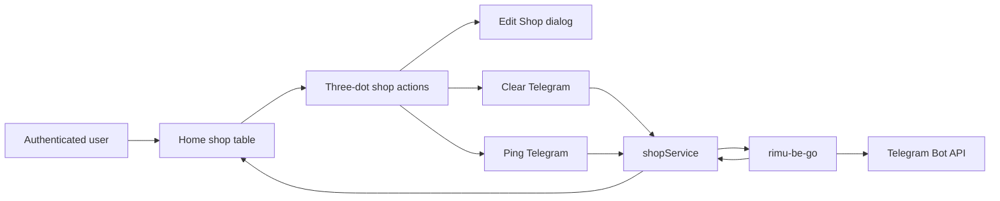
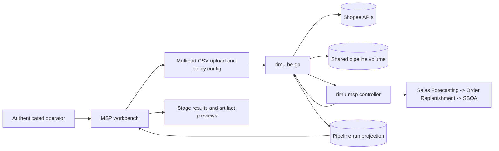
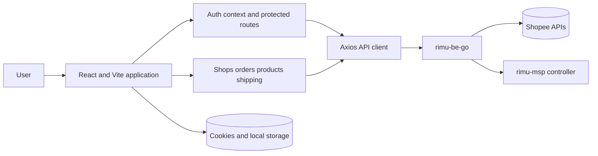

# React + TypeScript + Vite

## Shop Telegram actions

The authenticated shop table exposes one shadcn/ui three-dot `DropdownMenu` per shop. It
keeps shop editing, Telegram configuration removal, and Telegram connectivity
testing together. `Ping Telegram` sends no credentials from the browser; the
backend loads the encrypted destination for the owned shop and reports whether
Telegram accepted the test message.



`Edit Shop` uses the existing shop update API. `Clear Telegram` updates the
shop record with `clear_telegram_config`; `Ping Telegram` calls
`POST /api/shop/:shop_id/telegram/ping` and shows success or failure in a toast.

## MSP E2E procurement workbench

Authenticated operators can open `/msp` to upload the reviewed 1688-to-Shopee
mapping, supplier profile, SKU master, and business constraint CSVs. The
frontend sends them to `rimu-be-go` through one multipart upload-and-start
request. The backend owns shared-volume paths, Shopee stock and sales
preparation, and controller communication; the browser never calls the MSP
controller directly or receives service credentials. Each input also offers a
header-only CSV template generated from the schemas expected by the backend and
the SSOA stages.



## MSP E2E proof

The live flow is defined in `e2e/msp-workbench-flow.mjs`. It reads the staging
login and four CSV paths from `RIMU_E2E_USERNAME`, `RIMU_E2E_PASSWORD`,
`RIMU_E2E_ORDER_MAPPING_FILE`, `RIMU_E2E_SUPPLIER_INFO_FILE`,
`RIMU_E2E_SKU_MASTER_FILE`, and `RIMU_E2E_BUSINESS_CONSTRAINTS_FILE`.
Run it through the workspace recorder against the deployed staging frontend;
do not commit those values or source files.

This template provides a minimal setup to get React working in Vite with HMR and some ESLint rules.

## Dependency flow

This browser application owns presentation and user interaction. It calls the
authenticated Go backend through the shared Axios client; it never calls the
MSP controller or Python stages directly.



Currently, two official plugins are available:

- [@vitejs/plugin-react](https://github.com/vitejs/vite-plugin-react/blob/main/packages/plugin-react/README.md) uses [Babel](https://babeljs.io/) for Fast Refresh
- [@vitejs/plugin-react-swc](https://github.com/vitejs/vite-plugin-react-swc) uses [SWC](https://swc.rs/) for Fast Refresh

## Expanding the ESLint configuration

If you are developing a production application, we recommend updating the configuration to enable type aware lint rules:

- Configure the top-level `parserOptions` property like this:

```js
export default {
  // other rules...
  parserOptions: {
    ecmaVersion: 'latest',
    sourceType: 'module',
    project: ['./tsconfig.json', './tsconfig.node.json', './tsconfig.app.json'],
    tsconfigRootDir: __dirname,
  },
}
```

- Replace `plugin:@typescript-eslint/recommended` to `plugin:@typescript-eslint/recommended-type-checked` or `plugin:@typescript-eslint/strict-type-checked`
- Optionally add `plugin:@typescript-eslint/stylistic-type-checked`
- Install [eslint-plugin-react](https://github.com/jsx-eslint/eslint-plugin-react) and add `plugin:react/recommended` & `plugin:react/jsx-runtime` to the `extends` list
